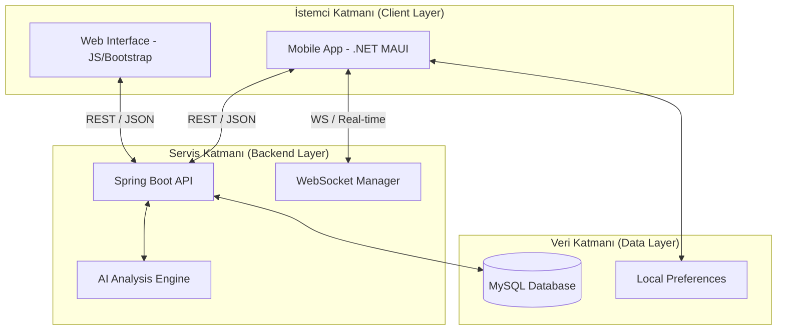
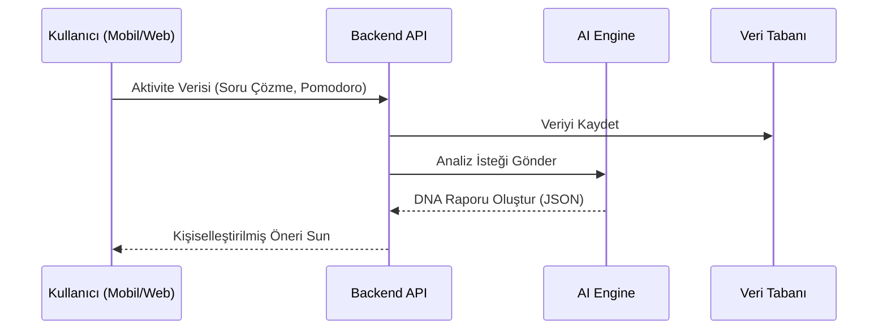

# S.I.P. Core: Akıllı Eğitim Ekosistemi ve Öğrenme DNA Analizi

🚀 **Platformlar Arası, Yapay Zeka Destekli Hibrit Öğrenme Platformu**

---

## 📖 Proje Vizyonu
**S.I.P. Core**, öğrenme sürecini statik bir yapıdan çıkarıp dinamik ve kişiselleştirilmiş bir deneyime dönüştüren akademik bir ekosistemdir. Projenin temel odağı, kullanıcının etkileşim verilerini analiz ederek bir **"Öğrenme DNA'sı"** oluşturmak ve bu veriye dayanarak gelişim yol haritası sunmaktır.

---

## 🏛️ Sistem Mimarisi (Architectural Overview)

Proje, üç ana katman üzerinde inşa edilmiş hibrit bir mimariye sahiptir. Aşağıdaki şemada veri akışı ve bileşenlerin etkileşimi görülmektedir:

---

## 🛠️ Teknik Derinlik ve Bileşen Analizi

### 1. Backend: Java Spring Boot Mimarisi
Sunucu tarafı, **Domain-Driven Design (DDD)** prensiplerine yakın bir katmanlı mimari kullanır:
-   **Controllers:** REST uç noktalarını (Endpoints) yönetir. (Örn: `EnglishHubController.java`)
-   **Services:** İş mantığının (Business Logic) koordine edildiği merkezdir.
-   **Repositories:** Spring Data JPA ve Hibernate ile veri tabanı soyutlaması sağlar.
-   **DTOs:** İstemci ve sunucu arasındaki veri transferini optimize eder.

### 2. Mobil: .NET MAUI & MVVM
Mobil uygulama, modern yazılım geliştirme standartlarına uygun olarak **Model-View-ViewModel (MVVM)** desenini benimser:
-   **View:** XAML tabanlı deklaratif arayüz.
-   **ViewModel:** Veri bağlama (Data Binding) ve komut (Command) yönetimi.
-   **Services:** `ApiClient.cs` üzerinden soyutlanmış ağ erişimi.
-   **Abstraction:** `IApiClient` arayüzü sayesinde test edilebilir ve esnek yapı.

---

## 🧩 Modüler Fonksiyonlar

| Modül | Teknik Açıklama | Kullanıcı Kazanımı |
| :--- | :--- | :--- |
| **Öğrenme DNA'sı** | Heuristic analiz algoritmaları kullanır. | Güçlü ve zayıf yönlerin keşfi. |
| **English Hub** | Seviye bazlı (A1-C2) dinamik içerik yükleme. | Bağlamsal kelime öğrenimi ve Tabu oyunu. |
| **SIP Dashboard** | Veri görselleştirme ve metrik takibi. | Tüm akademik sürecin tek noktadan yönetimi. |
| **Pomodoro** | Multithreaded zamanlayıcı ve sesli servisler. | Yüksek odaklanma ve verimli çalışma seansları. |

---

## 🔄 Veri Akış Şeması (Öğrenme DNA Analizi)

Kullanıcının yaptığı her etkileşim, sistem tarafından şu döngü ile işlenir:

---

## 🚀 Kurulum ve Entegrasyon

> [!IMPORTANT]
> Projeyi çalıştırmadan önce MySQL sunucunuzun aktif olduğundan ve `application.properties` dosyasındaki ayarların doğruluğundan emin olun.

### Hızlı Başlatma (Quick Start)
1.  **Backend:** `run_backend.bat` dosyasını çalıştırın.
2.  **Mobil:** `SipCoreDotnet/SipCore.Mobile` dizinine gidin ve `dotnet build -t:Run -f net8.0-android` komutunu verin.
3.  **Web:** `SIP_Frontend/index.html` dosyasını tarayıcıda açın.

---

## 🛡️ Güvenlik ve Erişim Yaklaşımı
Proje, geliştirme aşamasında **Erişilebilirlik Odaklı** bir yaklaşım sergiler. Mobil uygulamada kayıt zorunluluğu kaldırılarak, öğrenicilerin platformun teknik yeteneklerini anında deneyimlemesi hedeflenmiştir. Tüm ağ trafiği JSON standardında ve RESTful mimaridedir.

---

## 📬 İletişim & Akademik Destek

📧 **E-posta:** ahmetcanbozkurt295@gmail.com  
🔗 **GitHub:** [ahmetcann66](https://github.com/ahmetcann66)

---
*© 2026 S.I.P. Core - Modern Eğitim Teknolojileri Grubu*
