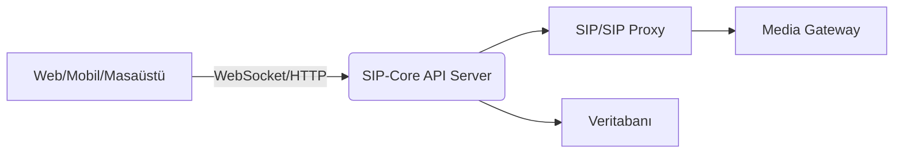

# SIP-Core

🚀 **SIP, VoIP, ve Gerçek Zamanlı Haberleşme İçin Açık Kaynak Çatı**

[](LICENSE)
[](https://github.com/ahmetcann66/SIP-Core)
[](https://github.com/ahmetcann66/SIP-Core)

---

## 🌟 Proje Amacı

**SIP-Core**, modern telekomünikasyon altyapısı, VoIP (Voice over IP) ve gerçek zamanlı iletişim uygulamaları için; platformlar arası çalışabilen, ölçeklenebilir, modüler ve açık kaynaklı bir temel sunmayı hedefler. Hem akademik hem de sektörel olarak kullanılabilir.

---

## 👨‍💻 Kullanılan Teknolojiler

- **Java / Spring Boot:** Sunucu uygulaması ve API servisi
- **C# / .NET MAUI:** Masaüstü ve mobil istemci uygulamaları (Windows, macOS, Android, iOS)
- **JavaScript:** Web tarafı istemci iş mantığı
- **HTML / CSS:** Modern, responsive web arayüzü
- **PowerShell:** Sistem yönetimi ve otomasyon betikleri
- **WebSocket:** Gerçek zamanlı, düşük gecikmeli iletişim

---

## 🧩 Ana Özellikler

- SIP (Session Initiation Protocol) desteği
- Gerçek zamanlı sesli/görüntülü iletişim ve mesajlaşma
- WebSocket üzerinden hızlı ve güvenli bağlantı
- RESTful API ile kolay entegrasyon
- Modern tasarıma sahip web ve mobil arayüzler
- Güçlü güvenlik: Kimlik doğrulama, JWT, TLS
- Mikroservis mimarisiyle ölçeklenebilirlik

---

## 🗂️ Proje Yapısı

```
SIP-Core/
├── server/         # Spring Boot tabanlı Java backend (API & SIP servisleri)
├── client/         # .NET MAUI tabanlı masaüstü & mobil istemci
├── web-client/     # Web arayüzü (JS, HTML, CSS)
├── scripts/        # Otomasyon ve yardımcı betikler (PowerShell)
└── docs/           # Belgeler ve şemalar
```

---

## ⚡ Kurulum ve Çalıştırma Adımları

### 1️⃣ Sunucu (Java / Spring Boot)

```bash
git clone https://github.com/ahmetcann66/SIP-Core.git
cd SIP-Core/server
./mvnw clean package
java -jar target/sip-core-server.jar
```

### 2️⃣ Masaüstü/Mobil İstemci (.NET MAUI)

.NET MAUI için:

```bash
cd SIP-Core/client
dotnet restore
dotnet build
dotnet run
```
> Gerekli bağımlılıkların yüklü olduğundan emin olun: [.NET 8+ SDK](https://dotnet.microsoft.com/en-us/download/dotnet/8.0)

### 3️⃣ Web İstemci

```bash
cd SIP-Core/web-client
npm install
npm start
```
Tarayıcı üzerinden: `http://localhost:3000`

---

## 🛰️ Uygulama Akış Şeması



---

## 🛡️ Güvenlik ve Kimlik Doğrulama

- JWT tabanlı kimlik doğrulama
- WebSocket üzerinden güvenli bağlantı (WSS, TLS)
- Kullanıcı kaydı ve rol tabanlı erişim

---

## 👏 Katkı Sağlama

1. Fork oluşturun & yeni dal açın (`feature/özellik`).
2. Değişiklik yapıp commit edin.
3. Açıklamalı pull request açın.
4. Kodunuzu test etmeyi ve dökümantasyonunuzu güncellemeyi unutmayın!

> Ayrıntılı katkı rehberi için [CONTRIBUTING.md](CONTRIBUTING.md)'ye bakınız.

---

## 📚 Akademik Atıf

> ahmetcann66. (2026). SIP-Core [Açık kaynak yazılım]. https://github.com/ahmetcann66/SIP-Core

---

## 📬 İletişim

Sorular ve öneriler için:  
📧 ahmetcanbozkurt295@gmail.com  
🐞 [GitHub Issues](https://github.com/ahmetcann66/SIP-Core/issues)

---

## 📝 Lisans

Bu proje MIT Lisansı ile lisanslanmıştır. Ayrıntılar için [LICENSE](LICENSE) dosyasını inceleyin.
